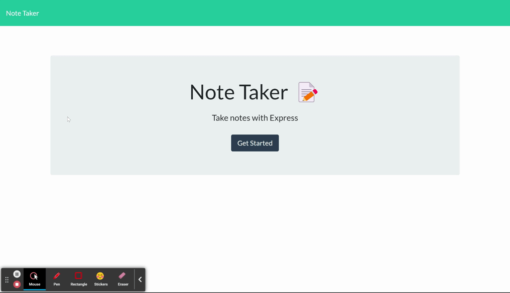

# Notes Application
  
  
  
---

   
  
  ## Description 
  ---
  A simple notes application that makes use of Express.js and allows the user to save and delete important notes. 

  The deployed link for the application can be found here:

  <a href="https://moecancodenotesapp.herokuapp.com">Notes app</a>

  This is what the layout of the application looks like:
  
   

  

   

  ## Table of Contents
  - [Installation](#installation)
  - [Usage](#usage)
  - [Contributors](#contributors)
  - [Technologies](#technologies)
  - [License](#license)
  - [Questions](#questions)

   

  ## Installation 
  ---
  The application can be used by visiting the deployed link given above. If you would like to clone and run this on your system, just make sure to run an `npm install` command.

   

  ## Usage
  ---
  The interface of the application is very intuitive and the headings & icons make it very easy to understand.
  
  This video demonstrates how to add and delete notes:

  

 

  You can also find these gifs inside the `assets` folder of this repository.

   

  ## Contributors
  ---
  Mohammad Abuzar Razvi

 

  ## Technologies
  ---

The technologies used in this app include:
* [Node.js](https://nodejs.org/en/)
* [Express.js](https://expressjs.com/)

  ## License 
  ---
  Click the link below to learn more about the license for this project:

  <a href = "https://opensource.org/licenses/MIT"> MIT </a>
  
   

  ## Questions
  ---
  You can find other interesting projects that I have worked on at:
  <a href = "https://github.com/moecancode"> Github </a>

  If you have any questions about my projects, you can contact me directly at a.releven@hotmail.com. 
